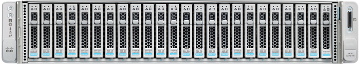

<h1 align="center">UCS CIMC Certificate Renewal Tool</h1>

<br>
<p align="center">
  
</p>  
<br>
<p align="center">
  The UCS CIMC Certificate Renewal Tool automates the process of generating a new standard or self-signed certificate signing request for the Cisco Integrated Management Controller (CIMC) of Cisco UCS C-Series and HyperFlex servers.
</p>
<br>

## Prerequisites
1. Python 3.7 or higher installed, which can be downloaded from [https://www.python.org/downloads/](https://www.python.org/downloads/).
    - If you're installing for the first time on Windows, select the option **"Add Python 3.x to PATH"** during the installation.
2. Clone or download the UCS CIMC Certificate Renewal Tool repository by using the  link on the main repository web page or by running the following command from the target directory if Git is locally installed:
    ```
    git clone https://github.com/ugo-emekauwa/ucs_cimc_csr_tool
    ```
   If you are downloading the repository file as a zipped file, unzip the file once the download has completed.
3. Install the required Python modules **requests** and **urllib3**. The requirements.txt file in the repository can be used for installation by running the following command:
    ```
    python -m pip install -r requirements.txt
    ```
4. The IP addresses of the targeted Cisco UCS server CIMCs.
5. User credentials with administrative rights on the targeted Cisco UCS server CIMCs.

After fulfilling the requirements listed in the [**Prerequisites**](https://github.com/ugo-emekauwa/ucs_cimc_csr_tool#prerequisites) section, **ucs_cimc_csr_tool.py** can be ran directly from your IDE or imported into another module.

## How to Use
1. Please ensure that the above [**Prerequisites**](https://github.com/ugo-emekauwa/ucs_cimc_csr_tool#prerequisites) have been met.
2. Within the unzipped UCS CIMC Certificate Renewal Tool repository, navigate to the ucs_cimc_csr_tool.py file.
3. Edit the ucs_cimc_csr_tool.py file to set all the configuration variable values using the following instructions:

    **(a).** Open the ucs_cimc_csr_tool.py file in an IDLE or text editor of choice.

    **(b).** Find the comment **`# MODULE REQUIREMENT 1 #`**.
    
      
      
    **(c).** Underneath, you will find the instructions to edit the configuration variable values to match your environment. Each variable has a sample value for ease of use. The variable values to edit begin under the comment **`####### Start Configuration Settings - Provide values for the variables listed below. #######`**.
      
      
   
    Completion of editing the configuration variable values is marked by the comment **`####### Finish Configuration Settings - The required value entries are complete. #######`**.
      
      
6. Save the changes you have made to the ucs_cimc_csr_tool.py file.
7. Run the ucs_cimc_csr_tool.py file.

## Notes
- For certificate signing requests, some remote servers may not work with SCP or SFTP. In such cases, FTP or TFTP should work.
- When using FTP or TFTP, ensure upload or write access is configured. For example:
  - On Ubuntu 22.04.x, if using vsftpd:
    1. Edit the FTP server configuration file.
       ```
       sudo nano /etc/vsftpd.conf
       ```
    2. Uncomment or set **write_enable** within the FTP server configuration file.
       ```
       write_enable=YES
       ```
    3. Restart the FTP server.
       ```
       sudo systemctl restart vsftpd.service
       ```
       
  - On Ubuntu 22.04.x, if using tftpd-hpa:
    1. Edit the TFTP server configuration file.
       ```
       sudo nano /etc/default/tftpd-hpa
       ```
    2. Set **TFTP_OPTIONS** within the TFTP server configuration file.
       ```
       TFTP_OPTIONS="--secure --create"
       ```
    3. Restart the TFTP server.
       ```
       sudo systemctl restart tftpd-hpa
       ```
- Ensure write access permissions are set on the remote server for the folder specified for the **csr_remote_server_filepath** variable.
- For TFTP, set the **csr_remote_server_filepath** variable to just "/".

## Related Tools
Here are similar tools to help administer and manage Cisco UCS environments.
- [Cisco IMM Automation Tools](https://github.com/ugo-emekauwa/cisco-imm-automation-tools)
- [Automated OS Install Tool for Cisco Intersight](https://github.com/ugo-emekauwa/intersight-os-installer)
- [Automated Server Power Control Tool for Cisco Intersight](https://github.com/ugo-emekauwa/intersight-server-power-control)

## Author
Ugo Emekauwa

## Contact Information
uemekauw@cisco.com or uemekauwa@gmail.com
